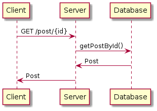

# Backend's and Database's Documentation

## Summary

[Data's Models in NoSQL Database](#data's-models-in-nosql-database)

[Describing Some Operations](#describing-some-operations)

## Data's Models in NoSQL Database

The image bellow shows the data models that will be used in this project, with fields that
are expected to have in a NoSQL database. The methods shows what kind of operations that
can be used to change fields, because some of the fields are dangerous to be changed and 
they don't have a special need to modified either, like the `userId` and `postId` are 
created when the object is created and have use only inside the system, and the user does
not need to know that it even exists.

This models uses the following fields as primary keys in each class:

- Post : `postId`
- UserLogin: `userId` or `username`(i) or `e-mail`(i)
- UserPublicData (ii)
- Review*** (iii)

i. `username` and `e-mail` are used as primary keys only in the login

ii. `UserPublicData` does not need a primary key as it is inside `UserLogin`

iii. `Review` does not need a primary key as it is inside `Post`

 

In the image bellow, shows the dependency between different models showed above.

## Describing Some Operations

- To login the client side sends `username` and `password` to server, then the server 
searches for a UserLogin object inside the database and compares the `password` given by
client in hash with the database's: if they match with each other, client receives a token; otherwise, it gets a null value.

- When user wants to visit another user, the client requests with the target's `userId` and
the server returns with only the target's public data.

- Similarly to getting a data from some user using an id, to access a post, the client asks
 the server to lookup for a post by an id, `postId`.

- To get all posts, you do not pass an `id`.

